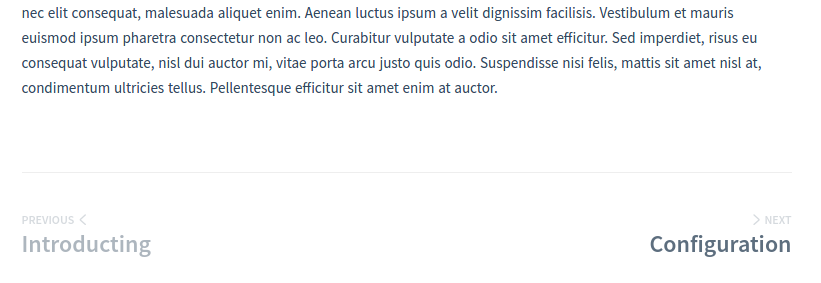

# docsify-pagination
> Pagination for docsify

[](https://www.npmjs.com/package/docsify-pagination)
[](./LICENSE)
[](http://makeapullrequest.com)

## How does it look like?


## Install
1. insert script into document

  ```html
  <script src="//unpkg.com/docsify-pagination/dist/docsify-pagination.min.js"></script>
  ```

2. specify the label text (optional)

  ```javascript
  window.$docsify = {
    // ...
    pagination: {
      previousText: '上一章节',
      // or
      nextText: {
        '/en/': 'NEXT',
        '/': '下一章节'
      }
      crossChapter: true,
      crossChapterText: true,
    },
  }
  ```

## Options
### pagination.previousText
* **Default:** ``'PREVIOUS'``
* **Type:** ``String | Object``
* **Description:** The text of previous label.

### pagination.nextText
* **Default:** ``'NEXT'``
* **Type:** ``String | Object``
* **Description:** The text of next label.

### pagination.crossChapter
* **Default:** `false`
* **Type:** ``Boolean``
* **Description:** Allow navigation to previous/next chapter.

### pagination.crossChapterText
* **Default:** `false`
* **Type:** ``Boolean``
* **Description:** Display chapter name.

### ~~pagination.routerMode~~
* **Deprecated**
* **Default:** [`window.$docsify.routerMode`](https://docsify.js.org/#/configuration?id=routermode)
* **Type:** ``String``
* **Description:** Router mode. In most cases, you don't need to modify it. Docsify-Pagination will take care of it for you.

## Example
### Run example on local

- [Example](example/default/index.html)
- [Example with Docsify's History Route-Mode](example/router-mode-history/index.html)
- [Example with Localization](example/router-mode-history/index.html)

#### How to open these?
```bash
$ git clone https://github.com/imyelo/docsify-pagination.git && cd docsify-pagination && yarn
$ yarn example
```

### Online Showcase
- [Tina.js](https://tina.js.org/)
- [😘 Tell us yours ...](https://github.com/imyelo/docsify-pagination/edit/master/readme.md)

## Related
- [docsify](https://github.com/QingWei-Li/docsify/)

## License
MIT &copy; [yelo](https://github.com/imyelo)
